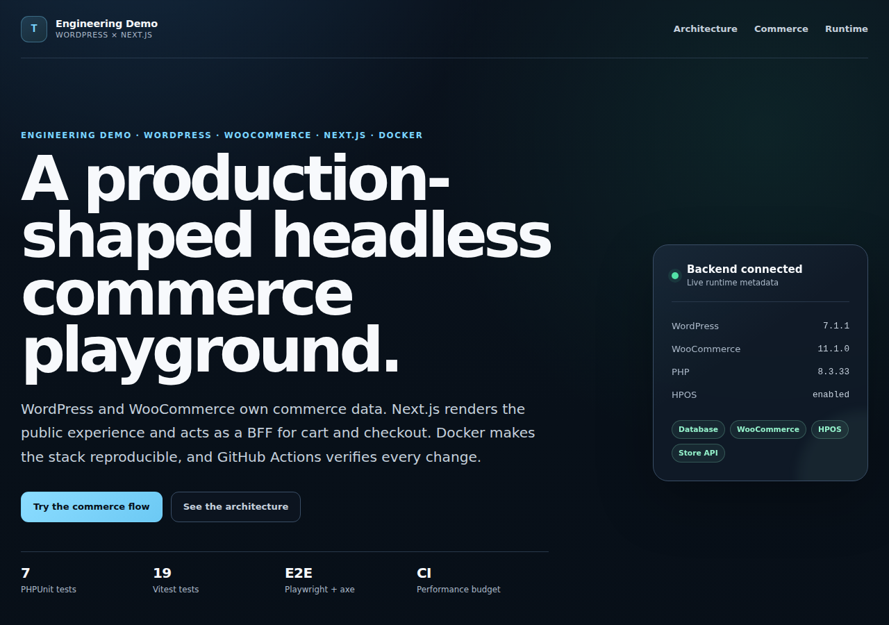
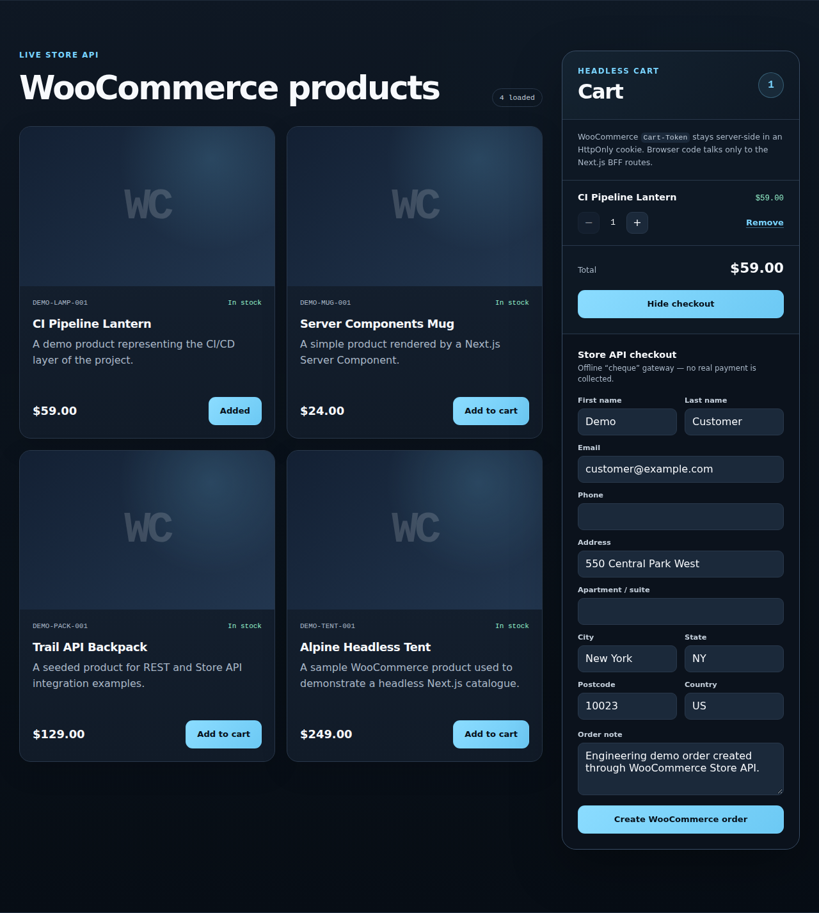
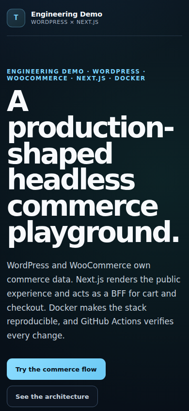
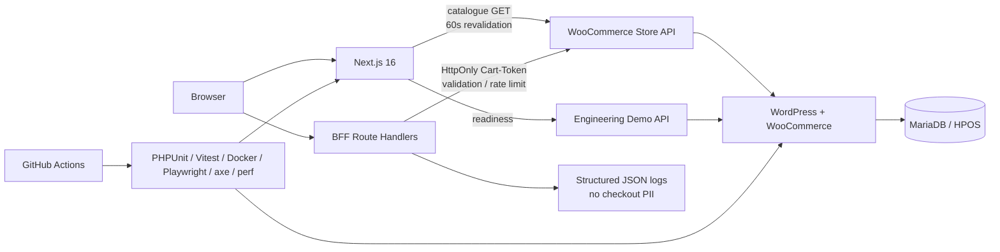

# Tuluzov Engineering Demo

[](https://github.com/tuluzov-star/engineering-demo/actions/workflows/ci.yml)

A production-shaped **WordPress + WooCommerce + Next.js** engineering case: headless catalogue, cart, checkout, HPOS, Docker, CI, accessibility, observability, performance budgets, backup and rollback.

This is not a theme demo. It is a compact example of how I would design boundaries around an existing WooCommerce domain while adding a modern frontend and delivery layer without duplicating commerce rules or patching WordPress/WooCommerce core.

> Live VPS deployment is intentionally pending until the personal hosting environment is available. Everything described as verified below is already exercised by CI against a real Docker WordPress/WooCommerce stack.

## Reviewer snapshot

| Area | Verified result |
| --- | --- |
| Backend | WordPress 7.1.x + WooCommerce 11.1.0 + HPOS |
| Frontend | Next.js 16.3.3 / React 19 / Node 24 |
| Commerce | real Store API cart + checkout + WooCommerce order creation |
| Backend tests | 7 PHPUnit tests / 38 assertions |
| Frontend tests | 19 Vitest unit/component tests |
| Browser | Playwright Chromium cart/checkout flow |
| Accessibility | axe WCAG A/AA checks, zero automated violations in tested states |
| Observability | request IDs + structured JSON logs without checkout PII |
| Delivery | production Compose + Caddy + backup + rollback + guarded CD |
| Performance | 245 ms TTFB / 412 ms LCP / 0 CLS in a representative post-polish CI run |

## Production UI captures

The screenshots below are generated against the **production standalone Docker target**, not the Next.js development server.



<details>
<summary>Checkout and mobile views</summary>

### Store API checkout



### Mobile



</details>

### Fast review path

If you only have a few minutes:

1. Read [the case study](docs/CASE_STUDY.md) for the engineering decisions and trade-offs.
2. Open [the architecture diagram](docs/ARCHITECTURE_DIAGRAM.md).
3. Check [validation evidence](docs/VALIDATION.md) for what is actually proven by CI.
4. Inspect the BFF routes under `frontend/src/app/api/` and the small WordPress plugin under `backend/wp-content/plugins/engineering-demo-api/`.
5. See [deployment design](docs/DEPLOYMENT.md) for HTTPS, backups and rollback.

## Architecture at a glance



The core rule is simple: **WooCommerce remains the commerce source of truth**. Next.js can shape requests, protect the public boundary and cache presentation data, but it does not reimplement stock, pricing, cart rules or order creation.

## What it demonstrates

- headless WooCommerce product catalogue
- Store API cart with add/update/remove operations
- server-side WooCommerce `Cart-Token` handling via an HttpOnly cookie
- Next.js Route Handlers as a Backend-for-Frontend boundary
- checkout and real WooCommerce order creation without a real payment transaction
- HPOS-aware WordPress/WooCommerce code and bootstrap
- bounded/validated mutation request bodies
- rate limiting for public cart and checkout mutations
- separate liveness/readiness probes for WordPress and Next.js
- structured JSON BFF request logs with request IDs and no checkout PII
- 19 Vitest unit/component tests across validation, cache policy and commerce UI behaviour
- 7 PHPUnit contract tests / 38 assertions for the custom WordPress API plugin
- axe-core WCAG A/AA checks for catalogue and checkout states
- 60-second Next.js revalidation for the public product catalogue only
- Playwright Chromium coverage for the real cart/checkout UI flow
- reproducible Docker infrastructure
- automated Docker integration smoke testing
- production Docker topology with Caddy HTTPS
- production performance budgets measured against the standalone Docker target
- release-based GitHub Actions deployment, backup and rollback workflows

## Stack

- WordPress 7.1.x
- WooCommerce 11.1.0
- PHP 8.3
- MariaDB 11.4
- Next.js 16.3.3 / React 19
- Node.js 24
- PHPUnit 11.5
- Vitest 5
- Playwright 1.63
- axe-core
- Docker Compose
- Caddy 2.11
- GitHub Actions

## Local start

### Windows / PowerShell

```powershell
Copy-Item .env.example .env
.\scripts\init.ps1
```

### macOS / Linux

```bash
cp .env.example .env
./scripts/init.sh
```

The init script builds and starts the services, installs WordPress, installs and activates WooCommerce, enables HPOS when required, configures the offline demo payment method, activates the custom demo API plugin, and seeds four virtual sample products.

Open:

- Next.js frontend: `http://localhost:3000`
- WordPress backend: `http://localhost:8080`
- backend liveness: `http://localhost:8080/wp-json/engineering-demo/v1/live`
- backend readiness: `http://localhost:8080/wp-json/engineering-demo/v1/ready`
- frontend liveness: `http://localhost:3000/api/live`
- frontend readiness: `http://localhost:3000/api/ready`
- backward-compatible backend health: `http://localhost:8080/wp-json/engineering-demo/v1/health`
- WooCommerce Store API: `http://localhost:8080/wp-json/wc/store/v1/products`

Before exposing the environment publicly, replace the demo credentials in `.env`.

## Cart and checkout boundary

The browser never receives the WooCommerce `Cart-Token` directly. It calls same-origin Next.js routes; the BFF talks to WooCommerce and stores the token in an `HttpOnly`, `SameSite=Lax` cookie.

```text
Browser -> Next.js BFF -> WooCommerce Store API -> WooCommerce order / HPOS
             |
             +-> HttpOnly cart-token cookie
```

Checkout uses WooCommerce's built-in offline `cheque` gateway with demo-only wording. **No real payment is collected.**

The mutation boundary rejects malformed or oversized JSON before it reaches WooCommerce. Cart mutations and checkout attempts use separate per-client rate-limit windows. The current limiter is deliberately process-local because the prepared production design is a single Next.js instance; horizontal scaling would move this state to Redis/KV.

## Tests

Frontend:

```bash
cd frontend
npm test
npm run e2e
```

Backend contract tests:

```bash
phpunit --configuration backend/phpunit.xml.dist
```

CI covers:

- PHP plugin contract behaviour
- validation and bounded JSON parsing
- rate limiting
- catalogue cache policy
- React cart/checkout component behaviour
- live Docker WordPress/WooCommerce bootstrap
- Store API cart and checkout
- WooCommerce order creation/retrieval with HPOS enabled
- browser cart/checkout interaction
- automated accessibility checks
- structured logging/request-ID propagation
- production performance budgets

CI keeps Playwright traces/screenshots/videos only when a browser test fails, uploads a JSON performance result, and regenerates production-target portfolio captures as an artifact for visual review.

## Performance budget

The budget is measured against the production standalone Next.js Docker target connected to the live Docker WordPress/WooCommerce backend.

| Metric | Budget | Recorded CI run |
| --- | ---: | ---: |
| TTFB | <= 1000 ms | 245 ms |
| LCP | <= 3000 ms | 412 ms |
| CLS | <= 0.1 | 0 |
| Load event | <= 4000 ms | 402.5 ms |
| Total encoded transfer | <= 1.5 MB | 153,501 B |
| Script encoded transfer | <= 800 KB | 134,413 B |
| DOM nodes | <= 700 | 208 |

The measured values are from a GitHub-hosted CI run on 2026-09-19, not a claim about real-user field latency. The committed budget is the regression guard.

## Production target

Prepared topology:

```text
Internet
   |
   v
Caddy :80/:443
   |----------------------|
   v                      v
lab.tuluzov.com           cms.lab.tuluzov.com
Next.js :3000             WordPress :80
   |                      |
   +------ backend -------+
              |
              v
          MariaDB
```

The existing `demo.tuluzov.com` remains an independent WordPress/WooCommerce plugin-demo site.

The inspected shared-hosting environment was deliberately rejected as the Next.js production target after confirming that it does not provide a usable Docker daemon for the hosting user and restricts the Passenger application type. The project avoids provider-specific Python-to-Node or unmanaged-daemon workarounds.

See [DEPLOYMENT.md](docs/DEPLOYMENT.md) for VPS, DNS, GitHub environment, backup and rollback details.

## Useful commands

### Local

```bash
docker compose ps
docker compose logs -f frontend
docker compose logs -f wordpress
docker compose run --rm wp-cli /scripts/bootstrap-wp.sh
docker compose run --rm wp-cli -c 'wp wc hpos status --allow-root'
sh scripts/smoke-test.sh
docker compose down
```

`docker compose down` keeps data volumes. `docker compose down -v` also deletes the database and WordPress data and should only be used for a full reset.

### Production

```bash
sh scripts/backup-production.sh /opt/engineering-demo
sh scripts/deploy-production.sh /opt/engineering-demo <git-sha>
sh scripts/rollback-production.sh /opt/engineering-demo
```

Production deployment remains disabled until the VPS and GitHub production secrets/variables are configured.

## Repository map

```text
.
├── backend/
│   ├── tests/
│   └── wp-content/plugins/engineering-demo-api/
├── deploy/
│   └── Caddyfile
├── frontend/
│   ├── e2e/
│   ├── performance/
│   ├── src/app/api/
│   ├── src/components/
│   └── src/lib/
├── scripts/
├── docs/
├── .github/workflows/
├── docker-compose.yml
└── docker-compose.production.yml
```

Further reading:

- [CASE_STUDY.md](docs/CASE_STUDY.md) — decisions, alternatives and trade-offs
- [ARCHITECTURE.md](docs/ARCHITECTURE.md) — detailed technical architecture
- [ARCHITECTURE_DIAGRAM.md](docs/ARCHITECTURE_DIAGRAM.md) — visual system map
- [DEPLOYMENT.md](docs/DEPLOYMENT.md) — production deployment and rollback
- [ROADMAP.md](docs/ROADMAP.md) — implementation stages
- [VALIDATION.md](docs/VALIDATION.md) — exact verification status
- [CHANGELOG.md](CHANGELOG.md) — milestone history

## CI

Every change is checked through GitHub Actions:

- ESLint and TypeScript
- 19 Vitest unit/component tests
- 7 PHPUnit contract tests / 38 assertions
- Next.js production build
- PHP and shell syntax
- local/production Docker Compose
- Caddy configuration
- production frontend image
- live Docker WooCommerce integration
- Playwright Chromium commerce flow
- axe WCAG A/AA regression checks
- liveness/readiness
- structured request logs without checkout PII
- production performance budgets

The CD workflow is guarded by `DEPLOY_ENABLED`, so production cannot be deployed accidentally before the target VPS is provisioned.
