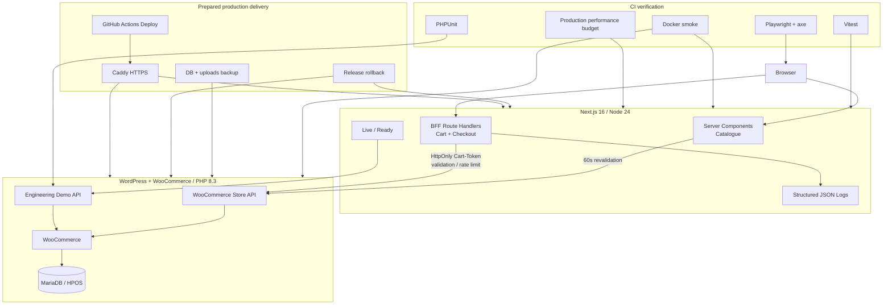

# Architecture Diagram

## Trust boundaries

1. Browser input is untrusted.
2. Next.js BFF bounds/parses/validates mutation requests before forwarding.
3. WooCommerce remains authoritative for commerce rules.
4. Cart-Token stays server-side and is exposed to the browser only as an HttpOnly cookie.
5. Structured logs intentionally exclude checkout values, IP address and Cart-Token.
6. Database and application containers are not directly published in the prepared production topology.
