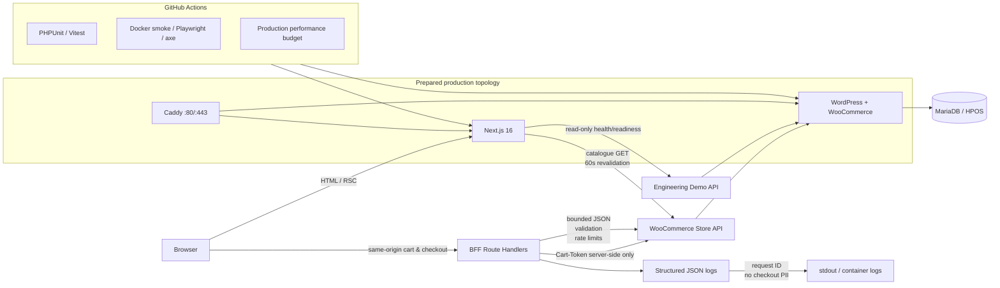

# Engineering Demo — Case Study

## Context

This project is a deliberately production-shaped headless commerce demo built around an existing WordPress/WooCommerce engineering background.

The goal was not to replace WordPress with a fashionable frontend. The goal was to show how a modern application layer can be added **without breaking the commerce source of truth, bypassing supported APIs, or weakening operational safety**.

The result is a small but complete system:

- WordPress + WooCommerce own products, prices, checkout and orders;
- Next.js provides the public UI and Backend-for-Frontend boundary;
- WooCommerce Store API handles cart and checkout;
- a minimal WordPress plugin exposes only project-specific read-only runtime metadata;
- Docker Compose makes local and production topology reproducible;
- CI verifies code quality, runtime behaviour, accessibility and performance;
- delivery code includes HTTPS, health checks, backups and rollback.

## What problem is this solving?

A typical WordPress portfolio proves that a developer can build themes and plugins. A typical frontend portfolio proves that a developer can build React UI.

This project tries to prove something broader:

> Can a WordPress/WooCommerce engineer design boundaries, deployment, observability and testing for a mixed PHP/Node commerce system without losing the guarantees that WooCommerce already provides?

The project therefore focuses on architecture and operational behaviour as much as visual frontend work.

## Architecture

## Key engineering decisions

### 1. WooCommerce remains the source of truth

**Decision:** products, prices, stock, cart rules, checkout validation and order creation stay in WooCommerce.

**Why:** duplicating commerce rules in Next.js would create two business-rule implementations that can drift.

**Consequence:** Next.js is allowed to validate request shape and user input early, but WooCommerce still performs authoritative commerce validation.

### 2. Use a BFF instead of exposing Cart-Token to browser JavaScript

**Decision:** the browser calls same-origin Next.js routes. The WooCommerce `Cart-Token` is stored in an `HttpOnly`, `SameSite=Lax` cookie and forwarded server-to-server.

**Alternative considered:** call Store API directly from browser code and store the token in JavaScript-accessible storage.

**Why rejected:** the BFF adds a clean security and policy boundary for validation, rate limiting, logging and future authentication.

**Trade-off:** there is one extra application hop.

### 3. Cache catalogue presentation, never transactional mutations

**Decision:** catalogue reads use a 60-second Next.js revalidation window and cache tag. Cart, checkout, health and readiness stay uncached.

**Why:** a brief catalogue snapshot is acceptable for presentation, while order correctness must always come from WooCommerce at mutation time.

**Trade-off:** catalogue content can be up to roughly one revalidation window old until explicit invalidation is added.

### 4. Keep rate limiting process-local for the current single-instance target

**Decision:** mutation rate-limit buckets live in the Next.js process.

**Why:** the prepared production design runs one frontend instance; introducing Redis only for a demo would add infrastructure without solving a current scaling problem.

**Scale-up path:** move bucket state to Redis/KV before horizontal frontend scaling.

### 5. Separate liveness from readiness

**Decision:** both WordPress and Next.js expose separate live/ready semantics.

**Why:** a process can be alive while its database, WooCommerce, HPOS or Store API dependency is unavailable.

**Operational consequence:** deployment promotion waits for readiness, while liveness remains useful for diagnosis.

### 6. Structured logs intentionally exclude checkout PII

**Decision:** commerce logs contain request ID, static route, status, outcome, duration and technical upstream/error metadata only.

**Why:** observability should not create an accidental customer-data store.

**Verification:** CI explicitly checks that the smoke-test checkout email is absent from frontend logs.

### 7. Use WooCommerce CRUD instead of asserting HPOS table layout

**Decision:** runtime verification retrieves the created order through WooCommerce CRUD.

**Why:** HPOS is an implementation/storage concern owned by WooCommerce. Tests should verify supported behaviour rather than couple themselves to internal tables.

### 8. Reject a fragile shared-hosting workaround

The available shared-hosting environment was inspected before choosing the deployment topology.

Confirmed limitations included no usable Docker daemon for the hosting user and a Passenger configuration that would not allow switching the application type to Node from `.htaccess`.

A Python-to-Node proxy or unmanaged background Node daemon was deliberately rejected. A small VPS preserves a reproducible Docker/Next.js architecture instead of turning deployment into provider-specific glue.

## Verification strategy

The project uses complementary layers instead of one oversized end-to-end test:

| Layer | What it proves |
| --- | --- |
| PHPUnit | custom WordPress plugin contract and degraded readiness behaviour |
| Vitest | pure validation, request parsing, rate limits, caching policy and React component behaviour |
| Docker smoke | real WordPress/WooCommerce bootstrap, Store API cart/checkout, HPOS order creation |
| Playwright | real browser cart/checkout behaviour |
| axe-core | automated WCAG A/AA regression checks for key UI states |
| performance budget | production Docker frontend remains within explicit regression limits |

Current confirmed CI coverage includes:

- 7 PHPUnit tests / 38 assertions;
- 19 Vitest unit/component tests;
- live Docker Store API cart and checkout;
- WooCommerce order creation and CRUD retrieval with HPOS enabled;
- Chromium Playwright cart/checkout flows;
- automated axe checks with zero violations in the tested catalogue/checkout states;
- production frontend performance regression budget.

## Performance result

A successful post-polish GitHub-hosted CI run on 2026-09-19 measured the production Docker frontend at:

| Metric | Measured | Budget |
| --- | ---: | ---: |
| TTFB | 245 ms | <= 1000 ms |
| LCP | 412 ms | <= 3000 ms |
| CLS | 0 | <= 0.1 |
| Load event | 402.5 ms | <= 4000 ms |
| Total transfer | 153,501 B | <= 1,500,000 B |
| JavaScript transfer | 134,413 B | <= 800,000 B |
| DOM nodes | 208 | <= 700 |

These are CI regression measurements, not real-user field metrics.

## Production readiness

Prepared and CI-validated:

- production Docker topology;
- Caddy TLS/reverse proxy configuration;
- dependency-aware health checks;
- immutable Git-SHA release directories;
- pre-deployment database/uploads backup;
- failed-deploy code rollback;
- manual rollback workflow;
- guarded GitHub Actions deployment.

Not claimed yet:

- live VPS deployment;
- live DNS/TLS validation;
- backup restoration drill;
- real-user performance telemetry.

Those remain intentionally separate until the personal deployment environment is available.

## What I would change at larger scale

For a higher-traffic or multi-instance deployment I would add:

- shared Redis/KV rate limiting;
- explicit catalogue cache invalidation from signed events/webhooks;
- centralized structured log collection;
- production RUM / Core Web Vitals;
- multiple frontend replicas behind the edge proxy;
- external database/backups depending on recovery requirements;
- stricter authentication/authorization if account-specific commerce features are introduced.

The current implementation avoids adding those components before the architecture requires them.
